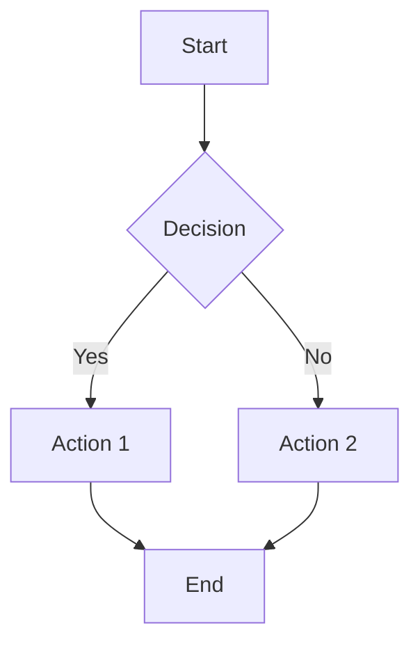
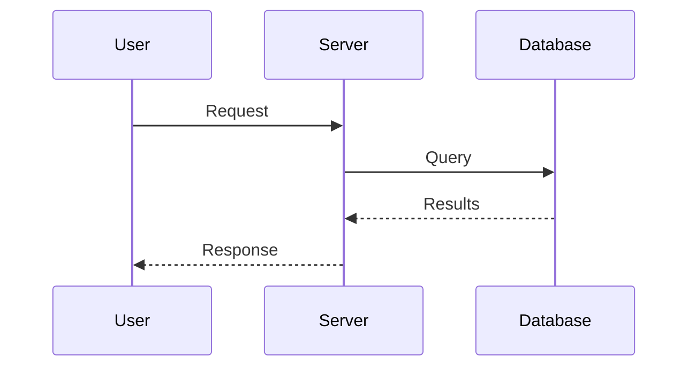
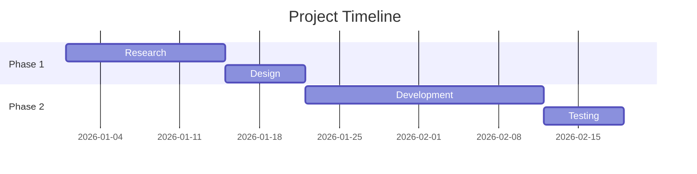
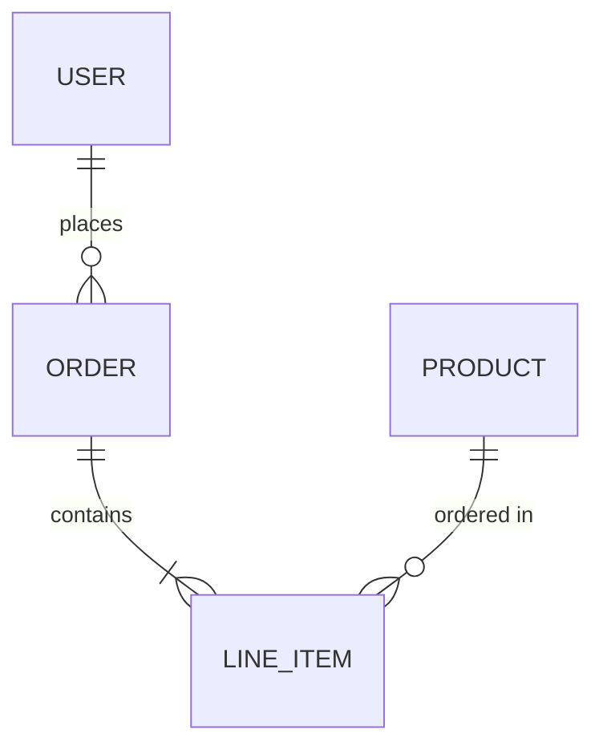
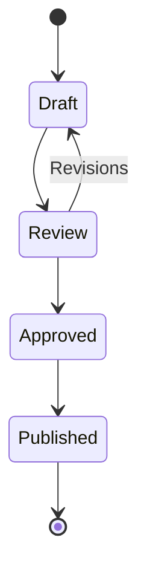
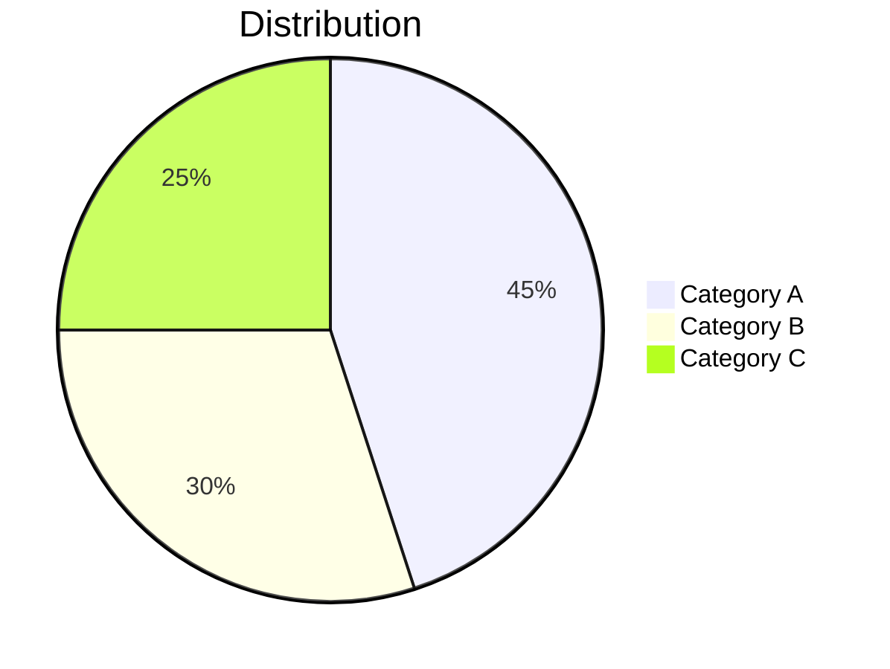

# Markdown Advanced Reference

Extended features, platform rendering notes, and ready-to-use document templates.

## Mermaid Diagrams

Mermaid diagrams render in GitHub, GitLab, Obsidian, and Claude artifacts. Use fenced code blocks with the `mermaid` language tag.

### Flowchart

````markdown

````

### Sequence Diagram

````markdown

````

### Gantt Chart

````markdown

````

### Entity Relationship Diagram

````markdown

````

### State Diagram

````markdown

````

### Pie Chart

````markdown

````

## LaTeX Math

Inline math: `$E = mc^2$` renders as E = mc²

Block math:

````markdown
$$
\frac{-b \pm \sqrt{b^2 - 4ac}}{2a}
$$
````

### Common Patterns

| Pattern | Syntax | Result |
|---------|--------|--------|
| Fractions | `$\frac{a}{b}$` | a/b |
| Subscripts | `$x_i$` | x subscript i |
| Superscripts | `$x^2$` | x squared |
| Greek letters | `$\alpha, \beta, \gamma, \theta$` | Greek symbols |
| Summation | `$\sum_{i=1}^{n} x_i$` | Sigma notation |
| Integrals | `$\int_0^{\infty} e^{-x} dx$` | Integral |
| Square root | `$\sqrt{x^2 + y^2}$` | Square root |
| Matrices | `$\begin{pmatrix} a & b \\ c & d \end{pmatrix}$` | 2x2 matrix |

## YAML Frontmatter

Metadata block at the top of Markdown files, used by static site generators, skills, and structured document systems:

```yaml
---
title: Document Title
date: 2026-02-10
author: Name
tags: [tag1, tag2]
description: Brief description for SEO or previews
draft: false
---
```

### Common Frontmatter Schemas

**Hugo/Jekyll blog post:**
```yaml
---
title: "Post Title"
date: 2026-02-10
categories: [category]
tags: [tag1, tag2]
description: "Meta description"
image: /images/hero.jpg
---
```

**Astro page:**
```yaml
---
layout: ../../layouts/Post.astro
title: "Post Title"
pubDate: 2026-02-10
---
```

**Agent skill:**
```yaml
---
name: skill-name
description: What the skill does and when to use it.
---
```

## Footnotes

```markdown
This claim needs a source[^1]. Another reference here[^2].

[^1]: Author, "Title," Publication, Year.
[^2]: URL or full citation.
```

Footnotes render as numbered superscripts with definitions collected at the bottom of the document.

## Admonitions / Callouts

### GitHub (blockquote syntax)

```markdown
> [!NOTE]
> Useful information that users should know.

> [!TIP]
> Helpful advice for doing things better.

> [!IMPORTANT]
> Key information users need to know.

> [!WARNING]
> Urgent info that needs immediate attention.

> [!CAUTION]
> Advises about risks or negative outcomes.
```

### Obsidian

```markdown
> [!info] Custom Title
> Content of the callout.

> [!warning] Be Careful
> Important warning content.
```

## Definition Lists

```markdown
Term 1
: Definition for term 1

Term 2
: Definition for term 2
: Additional definition
```

Supported in some Markdown processors (PHP Markdown Extra, Pandoc). Not in standard GFM.

## Collapsible Sections

Uses HTML `<details>` tag — works on GitHub, GitLab, and VS Code:

```markdown
<details>
<summary>Click to expand</summary>

Hidden content goes here. Leave a blank line after `<summary>` for Markdown rendering.

- Item one
- Item two

</details>
```

## Abbreviations

```markdown
The HTML specification is maintained by the W3C.

*[HTML]: Hyper Text Markup Language
*[W3C]: World Wide Web Consortium
```

Supported in PHP Markdown Extra and Pandoc. Not in standard GFM.

---

## Platform Rendering Reference

| Feature | GitHub | GitLab | Obsidian | Claude Artifacts | VS Code |
|---------|--------|--------|----------|-----------------|---------|
| Basic Markdown | Yes | Yes | Yes | Yes | Yes |
| GFM Tables | Yes | Yes | Yes | Yes | Yes |
| Task lists | Yes | Yes | Yes | Yes | Yes |
| Strikethrough | Yes | Yes | Yes | Yes | Yes |
| Mermaid diagrams | Yes | Yes | Yes | Yes | Plugin |
| LaTeX math | Yes | Yes | Yes | Yes | Plugin |
| Footnotes | Yes | Yes | Yes | Partial | Plugin |
| Admonitions | Yes (blockquote) | Yes | Yes (callout) | No | No |
| HTML embed | Limited | Limited | Yes | Limited | Yes |
| Collapsible (`<details>`) | Yes | Yes | Yes | No | Yes |
| Frontmatter display | Rendered | Rendered | Parsed/hidden | Ignored | Plugin |
| Syntax highlighting | Yes | Yes | Yes | Yes | Yes |
| Auto-linked URLs | Yes | Yes | Yes | Yes | No |
| Emoji shortcodes | Yes (`:smile:`) | Yes | Yes | No | No |

### Claude Artifact Best Practices

- Stick to standard Markdown + GFM extensions for maximum compatibility
- Mermaid and math render well — use them freely
- Avoid admonitions (use bold blockquotes instead)
- Avoid `<details>` tags (content won't be collapsible)
- Avoid emoji shortcodes (use Unicode emoji directly if needed)
- Tables, code blocks, and lists are the backbone of well-structured artifacts

---

## Document Templates

### Technical Report

```markdown
# [Report Title]

**Date:** YYYY-MM-DD
**Author:** [Name]
**Version:** 1.0
**Status:** Draft | Review | Final

---

## Executive Summary

[2-3 sentence overview of findings and recommendations]

## Table of Contents

1. [Background](#background)
2. [Methodology](#methodology)
3. [Findings](#findings)
4. [Recommendations](#recommendations)
5. [Appendix](#appendix)

---

## Background

[Context, problem statement, scope]

## Methodology

[How the analysis was conducted]

## Findings

### Finding 1: [Title]

[Evidence, data, analysis]

### Finding 2: [Title]

[Evidence, data, analysis]

## Recommendations

| Priority | Action | Owner | Timeline |
|----------|--------|-------|----------|
| High | [Action] | [Name] | [Date] |
| Medium | [Action] | [Name] | [Date] |

## Appendix

### A. Supporting Data

[Tables, charts, raw data]

### B. References

1. [Reference 1]
2. [Reference 2]
```

### Project README

```markdown
# Project Name

Brief description of the project (1-2 sentences).

## Features

- Feature one
- Feature two
- Feature three

## Quick Start

\`\`\`bash
# Installation
npm install project-name

# Run
npm start
\`\`\`

## Usage

[Code examples showing primary use cases]

## Configuration

| Option | Default | Description |
|--------|---------|-------------|
| `port` | `3000` | Server port |
| `debug` | `false` | Enable debug logging |

## Contributing

See [CONTRIBUTING.md](CONTRIBUTING.md) for guidelines.

## License

[MIT](LICENSE)
```

### Meeting Notes

```markdown
# Meeting: [Topic]

**Date:** YYYY-MM-DD
**Attendees:** [Names]
**Duration:** [Time]

## Agenda

1. [Topic 1]
2. [Topic 2]
3. [Topic 3]

## Discussion

### [Topic 1]

[Key points discussed]

### [Topic 2]

[Key points discussed]

## Decisions

- **Decision 1:** [What was decided and why]
- **Decision 2:** [What was decided and why]

## Action Items

- [ ] [Action] — Owner, Due Date
- [ ] [Action] — Owner, Due Date
- [ ] [Action] — Owner, Due Date

## Next Meeting

**Date:** YYYY-MM-DD
**Topics:** [Planned topics]
```

### API Documentation

```markdown
# API Reference

Base URL: `https://api.example.com/v1`

## Authentication

All requests require a Bearer token:

\`\`\`bash
curl -H "Authorization: Bearer YOUR_TOKEN" https://api.example.com/v1/resource
\`\`\`

## Endpoints

### GET /resource

Retrieve a list of resources.

**Parameters:**

| Name | Type | Required | Description |
|------|------|----------|-------------|
| `limit` | integer | No | Max results (default: 20) |
| `offset` | integer | No | Pagination offset |

**Response:**

\`\`\`json
{
  "data": [...],
  "total": 100,
  "limit": 20,
  "offset": 0
}
\`\`\`

**Status Codes:**

| Code | Description |
|------|-------------|
| 200 | Success |
| 401 | Unauthorized |
| 404 | Not found |

### POST /resource

Create a new resource.

**Body:**

\`\`\`json
{
  "name": "string (required)",
  "description": "string (optional)"
}
\`\`\`
```

### Changelog

```markdown
# Changelog

All notable changes documented here. Format based on [Keep a Changelog](https://keepachangelog.com/).

## [Unreleased]

### Added
- New feature description

### Changed
- Updated feature description

## [1.0.0] - YYYY-MM-DD

### Added
- Initial release
- Feature one
- Feature two

### Fixed
- Bug fix description
```

### Standard Operating Procedure (SOP)

```markdown
# SOP: [Process Name]

**Owner:** [Name/Role]
**Last Updated:** YYYY-MM-DD
**Review Cycle:** Quarterly

## Purpose

[Why this process exists and what it achieves]

## Scope

[Who this applies to and when to use it]

## Prerequisites

- [ ] [Required access, tool, or knowledge]
- [ ] [Required access, tool, or knowledge]

## Procedure

### Step 1: [Action]

[Detailed instructions]

### Step 2: [Action]

[Detailed instructions]

### Step 3: [Action]

[Detailed instructions]

## Troubleshooting

| Issue | Cause | Resolution |
|-------|-------|------------|
| [Problem] | [Why it happens] | [How to fix] |

## Related Documents

- [Document 1](link)
- [Document 2](link)
```

### Decision Record (ADR)

```markdown
# ADR-[NUMBER]: [Decision Title]

**Date:** YYYY-MM-DD
**Status:** Proposed | Accepted | Deprecated | Superseded
**Deciders:** [Names]

## Context

[What is the issue that we're seeing that motivates this decision?]

## Decision

[What is the change that we're proposing and/or doing?]

## Consequences

### Positive
- [Benefit 1]
- [Benefit 2]

### Negative
- [Trade-off 1]
- [Trade-off 2]

### Neutral
- [Side effect 1]

## Alternatives Considered

### [Alternative 1]
[Why it was rejected]

### [Alternative 2]
[Why it was rejected]
```
